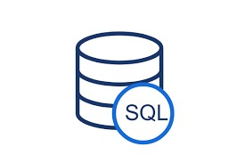

# HTTP-5126 - Database Design and Development

## Overview



Welcome to the HTTP-5126 Database Design and Development repository! This collection contains all assignments, lab work, and practice files relevant to the course. It's designed to help you enhance your understanding of database concepts and SQL.

> *Note:* You can gain hands-on experience with SQL using SQL Bolt.
### Code Example

Here is a standard MySQL query structure that illustrates how to select data from a database:

```sql
SELECT column_name(s)
FROM table_name
WHERE condition
GROUP BY column_name(s)
ORDER BY column_name(s);
```